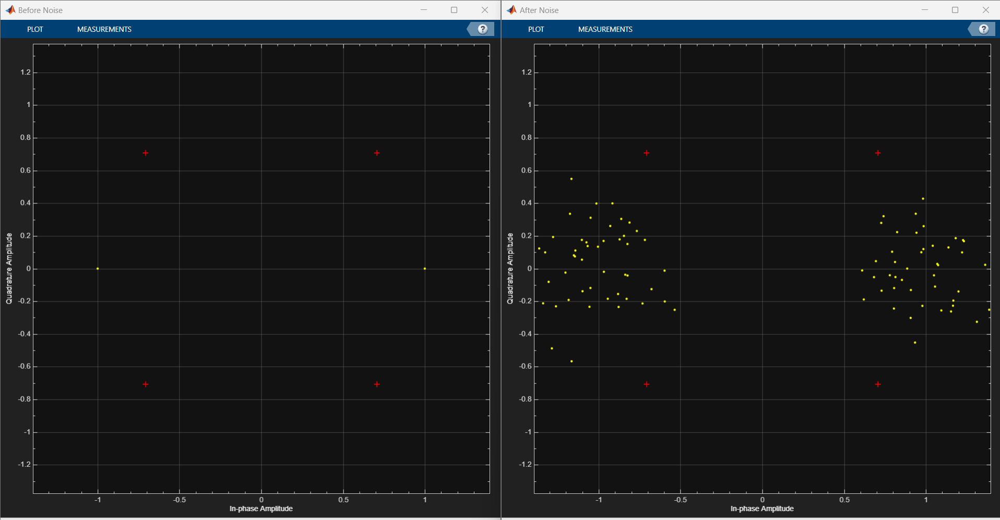

# Digital Communication Modelling in Simulink

## Description
This project focuses on simulating digital communication systems using Simulink. Implemented modulation schemes include Binary Phase Shift Keying (BPSK), Quadrature Phase Shift Keying (QPSK), and 16 Quadrature Amplitude Modulation (16 QAM). Each modulation scheme is simulated to analyze its performance in terms of Bit Error Rate (BER) against Signal-to-Noise Ratio (SNR). The simulations include the usage of AWGN (Additive White Gaussian Noise) channel to represent realistic channel conditions.

## Modulation Schemes

### BPSK (Binary Phase Shift Keying)
#### Key Features:
- BPSK modulates binary data onto a carrier signal by shifting its phase.
- Simple to implement and robust against channel impairments.
- Suitable for low-complexity applications.

#### Scatter Plot

#### BER vs SNR Curve

### QPSK (Quadrature Phase Shift Keying)
#### Key Features:
- QPSK modulates data using four phase shifts of the carrier signal.
- More bandwidth-efficient compared to BPSK.
- Robust against phase noise and multipath fading.

#### Scatter Plot

#### BER vs SNR Curve

### 16 QAM (16 Quadrature Amplitude Modulation)
#### Key Features:
- 16 QAM modulates data by varying both amplitude and phase of the carrier signal.
- Higher spectral efficiency compared to BPSK and QPSK.
- More susceptible to noise and channel distortions.

#### Scatter Plot

#### BER vs SNR Curve

